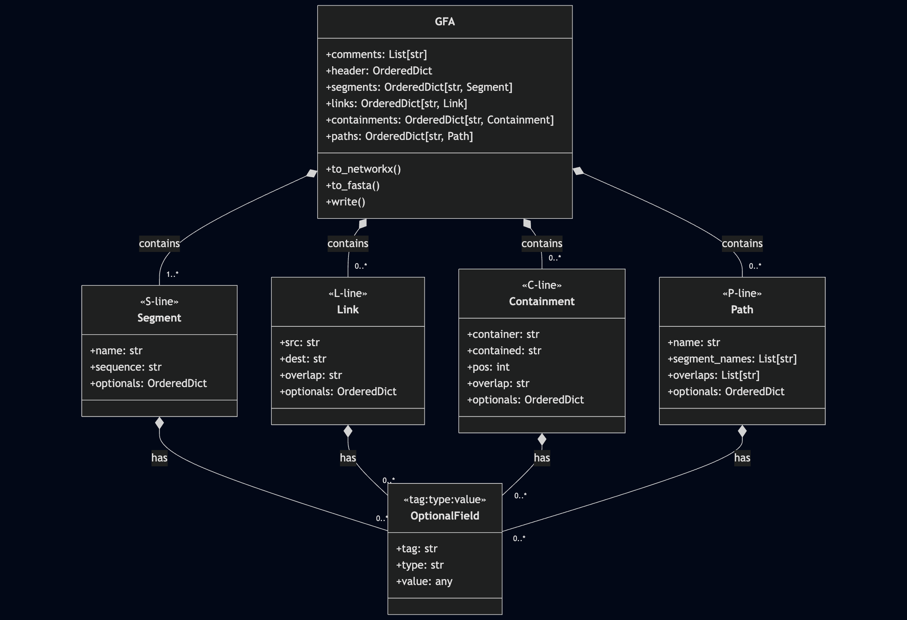

# GFA IO module

Currently this module reads and writes GFA v1 and is capable of a number of mundane tasks. 

## Changes

### Version 0.3.1
- Requires Python 3.11
- Migrated to pyproject
- Thorough unit testing (pytest)
- Added typing

## Use Cases

- Provide a simple means of loading GFA files as objects in Python.
- Dump segment sequences to FASTA format.
- Update segment sequences from FASTA, such as after post-assembly polishing.
- Permit representations within Networkx package.
- Report isolated segments (potentially closed squences) within the assembly.

## Installation

```bash
# standard install
pip install git+https://github.com/cerebis/gfa_io
```
### Development installation to local directory
The following will prepare an editable installation of gfa_io, along with all supporting dependencies for unit testing.
```bash
# Fetch from Github
git clone https://github.com/cerebis/gfa_io
cd gfa_io
# Assuming Python>=3.11 and pip>=25.1.1 are installed
python -m venv .venv
.venv/bin/pip install --group dev -e .
# Run unit tests
.venv/bin/python -m pytest
```

## Explanation of the Python object

- `class gfa_io.GFA`: This is the central container class. When you create a object, it reads a GFA file and populates its internal dictionaries (segments, links, etc).
- Connecting lines with a filled diamond indicate composition.
- Component Classes:
    - Segment, Link, Containment, and Path each represent a specific GFA record type.
    - These one-to-many relationships are stored as OrderedDictS, where order is dictated by the source file.
- For each of these component classes, optional key-value fields are supported e.g. `LN:i:100` and stored as instances of `gfa_io.OptionalField`.




## Example use

Code snippet demonstrating how one can load a GFA file from disk, transform it into a networkx.MultiGraph and save the resulting graph in three file formats.

```python
import gfa_io
import networkx

# read in the GFA file
gfa = gfa_io.GFA('assem.gfa', ignore_isolate_paths=True)
# create a MultiGraph()
g = gfa.to_networkx(annotate_paths=True, collections_to_str=True, include_seq=True)
# write to GraphML format
networkx.write_graphml(g, 'assem.graphml')
networkx.write_gml(g, 'assem.gml')
networkx.write_edgelist(g, 'assem.csv')
```

## Command line interface

A small utility `gfa_utils` is included as part of this package with the following subcommands.

### Command: update-segments
Replace sequences in the GFA file with those in a supplied FASTA file. It is expected that the sequence
records match between the GFA and FASTA file.

One use-case is updating a GFA with post-assembly polished sequences.

```bash
gfa_utils update-segments GFA_IN FASTA_IN GFA_OUT
```

### Command: isolates

Analyse a GFA file for segments which are network isolates (unattached) and report in CSV format.

Additional simple criteria can be imposed on the result, such as that a segment must refer to itself (circular), min and maximul segment length.

```bash
gfa_utils isolates GFA_IN ISOLATE_CSV
```

### Command: dump-segments

Extract the segment sequences in FASTA format.

```bash
gfa_utils dump-segments GFA_IN FASTA_OUT
``` 

### Command: convert

The following will read a GFA file and write a corresponding graph using NetworkX. File format can be one of GraphML, GML or an edge list.

```bash
> python gfa_utils convert -f graphml $GFA_IN $GRAPHML_OUT
```
